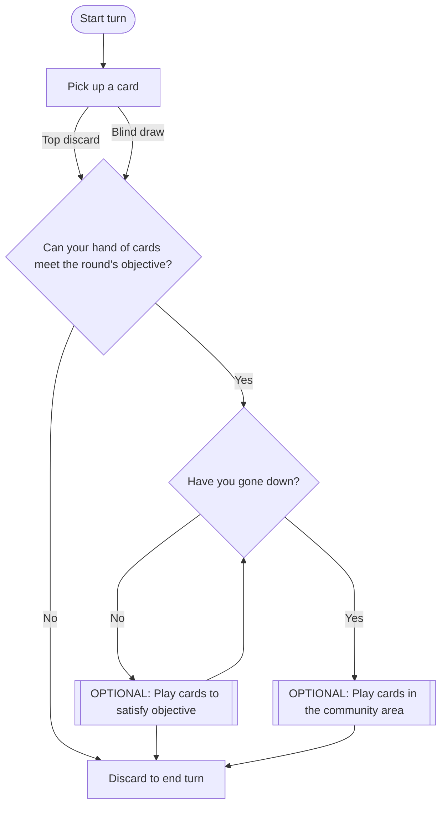

# Shanghai

Shanghai is a game played in seven rounds. Each round ends when a player successfully plays all their cards on the table, keeping one back for a final discard. Successfully playing all ones cards is called ***going out***. After a player ***goes out***, other players congratulate the winner of the round by offering a quarter and a compulsory "congratulations". All players count the cards remaining in their hands to determine their points.

| Card               | Point Value |
| ------------------ | ----------- |
| King through Eight | 10          |
| Seven through Two  | 5           |
| Ace                | 20          |
| Joker              | 50          |

The player with the lowest score at the end of all seven rounds wins the game and the "pot".

Gameplay follows chart below.

Each round has a unique objective to satisfy. The objective is always a combination of ***Sets*** and ***Runs***.

!!! info "Set"
    Three or more cards of the same rank. Suits do not matter. Jokers may be included as wilds, but when a set is first laid down, natural (non-wild) cards must make up the majority.

!!! info "Run"
    Four or more consecutive cards of the same suit. Jokers may be used as wilds, but the initial four cards forming the run may contain at most one Joker. Aces may be high or low, but cannot be both in the same run (e.g., **Q-K-A** or **A-2-3** is valid; **K-A-2** is not).

| Round | Objective         |
| ----- | ----------------- |
| One   | Two Sets          |
| Two   | One Set, One Run  |
| Three | Two Runs          |
| Four  | Three Sets        |
| Five  | Two Sets, One Run |
| Six   | One Set, Two Runs |
| Seven | Three Runs        |

Buying a Discard: When a card is discarded, any player may claim it by saying “I’ll buy it.” If multiple players speak up, priority goes clockwise from the discarding player. Declaring “I’ll buy it” is binding—if you cannot legally purchase (e.g., you’ve used all your buys), you must still pay the cost as a penalty. Each purchased discard costs one quarter.

When a player successfully buys a discard, they must also pick up another blind card. Players can purchase a max of three cards per round.

After a discard is bought, play continues as normal from the player to whom the discard was given.

## Ground Rules

- No phones allowed at the table during a round
- No walking away from the table during a round (e.g., to get more snacks or go the bathroom)
- If you ***need*** to pause the game for some reason, you must explain yourself to the group and convince them it's worth it

## AI Copy

Shanghai

Shanghai is a rummy-style card game played over seven rounds. Each round has its own objective that players must meet by laying down combinations of cards. The round ends when one player successfully plays all their cards onto the table, keeping one card back for a final discard—this is called going out.

At the end of each round, scores are tallied based on the cards left in players’ hands. After seven rounds, the player with the lowest total score wins the game and claims the pot.

⸻

Setup
	•	Shanghai is played with 2 decks of cards including jokers (108 cards total).
	•	Each player antes 4 quarters ($1) into the pot at the start of the game.
	•	A dealer is chosen at random for the first round. Deal passes clockwise each new round.
	•	Each round begins with the dealer shuffling and dealing 11 cards to each player.
	•	The remaining cards are placed face-down as the draw pile; the top card is turned face-up to form the discard pile.

⸻

Card Values

Card	Point Value
King through Eight	10
Seven through Two	5
Ace	20
Joker	50

⸻

Objectives by Round

Each round requires a specific combination of Sets and Runs before a player can “go down” (lay their initial meld on the table). Once down, players may also play on other players’ sets and runs.

Round	Objective
One	Two Sets
Two	One Set, One Run
Three	Two Runs
Four	Three Sets
Five	Two Sets, One Run
Six	One Set, Two Runs
Seven	Three Runs

⸻

What Counts as a Set?
	•	A Set is three or more cards of the same rank.
	•	Suits do not matter.
	•	Jokers may be used as wilds, but natural cards must be the majority when the set is first laid down.

⸻

What Counts as a Run?
	•	A Run is four or more consecutive cards of the same suit.
	•	Jokers may be used as wilds, but the initial four cards must include at most one Joker.
	•	Aces may be high or low but cannot wrap around (“turn the corner”).
	•	Valid: Q-K-A, A-2-3
	•	Invalid: K-A-2

⸻

Gameplay

Play proceeds clockwise. On your turn:
	1.	Draw a card
	•	Either take the top card of the discard pile, or draw blindly from the draw pile.
	2.	Go Down (optional)
	•	If your hand meets the round’s objective, you may lay down your required sets/runs.
	•	Once down, you may also add cards to your own melds or to other players’ melds.
	3.	Play Additional Cards (optional)
	•	Extend existing sets/runs with matching cards.
	•	After going down, you can also play onto others’ melds.
	4.	Replace Jokers (optional)
	•	If you hold the exact card a Joker represents in a Run, you may swap your card in, freeing the Joker for later play.
	•	Jokers in Sets cannot be reclaimed (their value is ambiguous).
	5.	Discard to end your turn
	•	Every turn ends with one discard—even if you are going out.

⸻

Buying a Discard
	•	When a card is discarded, any player may call “I’ll buy it.”
	•	If multiple players speak up, priority goes clockwise from the discarding player.
	•	Buying is binding—if you cannot buy (out of quarters or past your limit), you must still pay as a penalty.
	•	Each purchase costs 1 quarter and requires drawing one extra blind card as well.
	•	A player may buy a maximum of three cards per round.
	•	Once a player has gone down, they may not buy for the rest of that round.

⸻

End of a Round
	•	A round ends when a player goes out by playing all their cards and discarding their final one.
	•	All other players count the point value of cards left in their hands.
	•	Each loser must also pay the winner 1 quarter as a congratulations tribute.

⸻

End of the Game
	•	After all seven rounds, scores are totaled.
	•	The player with the lowest score wins the game and the pot.

⸻

Ground Rules
	•	No phones at the table during a round.
	•	No leaving the table mid-round (bathroom/snacks included).
	•	To pause, you must explain yourself to the group and get their agreement.

⸻

Player Quick Reference
	•	Ante: 4 quarters / $1
	•	Hand Size: 11 cards each round
	•	Discard Buying: Max 3 per round; each costs 1 quarter + 1 blind card
	•	Going Down: Must satisfy round’s objective with Sets/Runs
	•	Going Out: Play all cards + discard final one
	•	Winner Tribute: Losers pay 1 quarter each