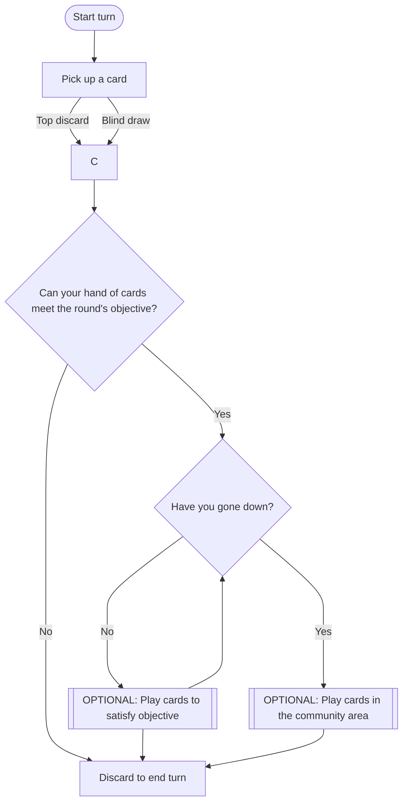

# Shanghai Rules

Shanghai is a game played in seven rounds. Each round ends when a player successfully plays all their cards on the table, keeping one back for a final discard. Successfully playing all ones cards is called ***going out***. After a player ***goes out***, other players congratulate the winner of the round by offering a quarter and a compulsory "congratulations". All players count the cards remaining in their hands to determine their points.

| Card               | Point Value |
| ------------------ | ----------- |
| King through Eight | 10          |
| Seven through Two  | 5           |
| Ace                | 20          |
| Joker              | 50          |

The player with the lowest score at the end of all seven rounds wins the game and the "pot".

Gameplay follows chart below.

Each round has a unique objective to satisfy. The objective is always a combination of ***Sets*** and ***Runs***.

!!! info Set
    Three or more cards of the same rank. Suits do not matter. Jokers may be included as wilds, but when a set is first laid down, natural (non-wild) cards must make up the majority.

!!! info Run
    Four or more consecutive cards of the same suit. Jokers may be used as wilds, but the initial four cards forming the run may contain at most one Joker. Aces may be high or low, but cannot be both in the same run (e.g., **Q-K-A** or **A-2-3** is valid; **K-A-2** is not).

| Round | Objective         |
| ----- | ----------------- |
| One   | Two Sets          |
| Two   | One Set, One Run  |
| Three | Two Runs          |
| Four  | Three Sets        |
| Five  | Two Sets, One Run |
| Six   | One Set, Two Runs |
| Seven | Three Runs        |

Buying a Discard: When a card is discarded, any player may claim it by saying “I’ll buy it.” If multiple players speak up, priority goes clockwise from the discarding player. Declaring “I’ll buy it” is binding—if you cannot legally purchase (e.g., you’ve used all your buys), you must still pay the cost as a penalty. Each purchased discard costs one quarter.

When a player successfully buys a discard, they must also pick up another blind card. Players can purchase a max of three cards per round.

After a discard is bought, play continues as normal from the player to whom the discard was given.

## Ground Rules

- No phones allowed at the table during a round
- No walking away from the table during a round (e.g., to get more snacks or go the bathroom)
- If you ***need*** to pause the game for some reason, you must explain yourself to the group and convince them it's worth it